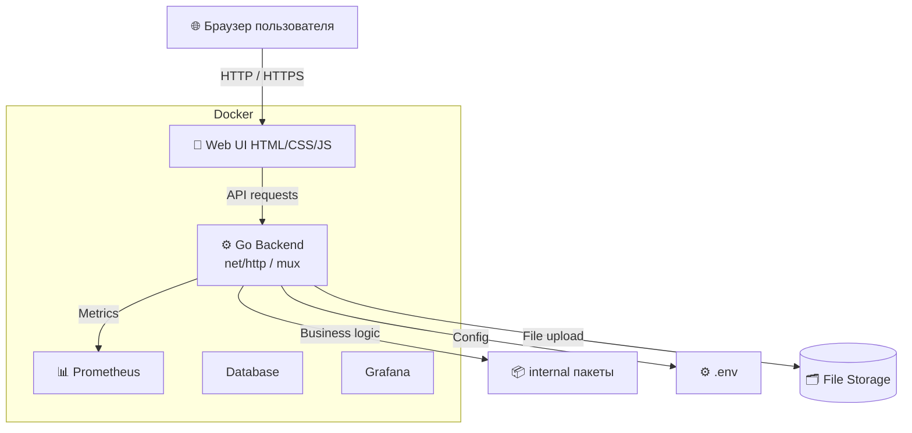
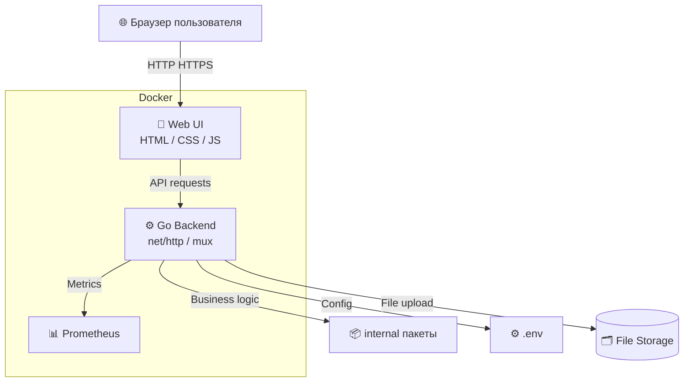
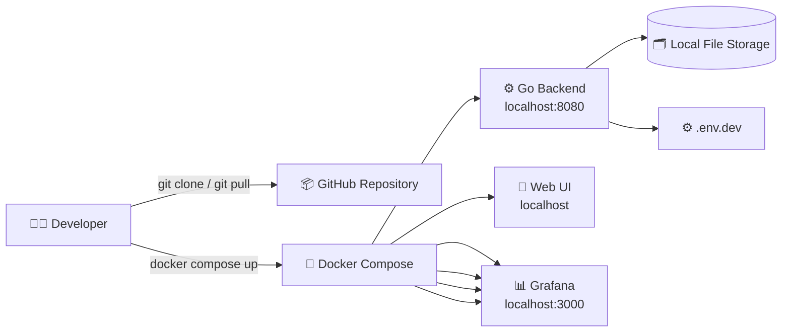
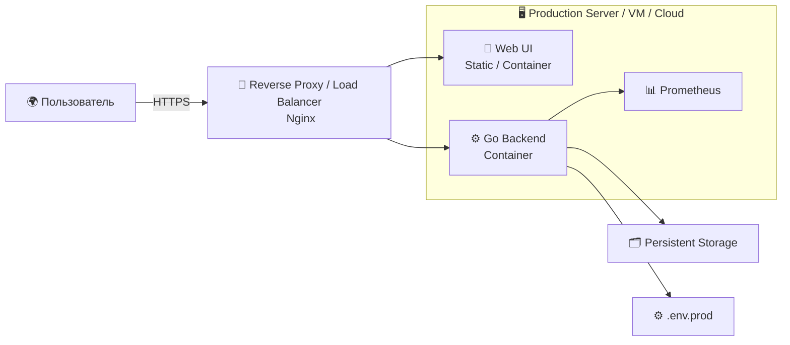
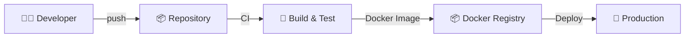

# 📝 Выпускная квалификационная работа проекта **finalwork**

## 1. Введение

Проект **finalwork** — это веб-приложение с серверной частью на **Go**, веб-интерфейсом и контейнеризацией через **Docker**.
Цель работы: разработка многокомпонентной системы с современными подходами к backend, frontend, деплою и мониторингу.

**Задачи проекта:**

1. Разработка backend на Go с REST API.
2. Создание веб-интерфейса для пользователя.
3. Контейнеризация сервисов с помощью Docker / Docker Compose.
4. Настройка мониторинга через Prometheus.
5. Обеспечение безопасности и готовности к production.

---

## 2. Описание проекта

Проект состоит из следующих компонентов:

* **Backend** — сервер на Go, обрабатывающий бизнес-логику и API-запросы.
* **Frontend** — веб-интерфейс на HTML, CSS, JS, позволяющий пользователю взаимодействовать с приложением.
* **Database** — хранение объектов системы в базе данных Postgresql.
* **Storage** — локальное хранилище файлов.
* **Monitoring** — Prometheus для сбора метрик.
* **Docker / Docker Compose** — инфраструктура для развёртывания и тестирования.
* **Reverse Proxy** — Nginx для маршрутизации и HTTPS в production.

---

## 3. Архитектура системы

### 3.1 Компоненты



---

### 3.2 Поток авторизации



---

### 3.3 Диаграмма деплоя

**Dev Environment**



**Prod Environment**



---

## 4. API Documentation

### Базовый URL

```
http://localhost:8080
```

### Эндпоинты

| Метод | URL            | Описание                    |
| ----- | -------------- | --------------------------- |
| POST  | /login         | Авторизация пользователя    |
| POST  | /logout        | Завершение сессии           |
| GET   | /news          | Получение защищённых данных |
| POST  | /upload        | Загрузка файла              |
| GET   | /metrics       | Метрики Prometheus          |

**Пример запроса авторизации:**

```json
POST /login
{
  "login": "user",
  "password": "password"
}
```

---

## 5. Docker и контейнеризация

### 5.1 Docker Compose (Production)

```yaml
version: "3.9"

services:
  backend:
    image: finalwork-backend:latest
    container_name: finalwork-backend
    restart: always
    env_file:
      - .env.prod
    expose:
      - "8080"
    volumes:
      - ./data/uploads:/app/uploads
    networks:
      - finalwork_net

  frontend:
    image: finalwork-frontend:latest
    container_name: finalwork-frontend
    restart: always
    expose:
      - "80"
    networks:
      - finalwork_net

  postgres:
    container_name: finalwork-postgres
    image: postgres
    environment:
      POSTGRES_DB: ${POSTGRES_DB}
      POSTGRES_USER: ${POSTGRES_USER}
      POSTGRES_PASSWORD: ${DB_DEFAULT_PASSWORD}
      PGDATA: "/var/lib/postgresql/data/pgdata"
    ports:
      - "5432:5432"
    volumes:
      - ./scripts/initdb.sh:/docker-entrypoint-initdb.d/initdb.sh
      - db-data:/var/lib/postgresql/data/pgdata
    healthcheck:
      test: ["CMD-SHELL", "pg_isready -U postgres -d postgres"]
      interval: 10s
      timeout: 5s
      retries: 5
      start_period: 10s
    restart: unless-stopped
    deploy:
      resources:
        limits:
          cpus: '1'
          memory: 4G
    networks:
      - finalwork-network

  nginx:
    image: nginx:alpine
    container_name: finalwork-nginx
    restart: always
    ports:
      - "80:80"
      - "443:443"
    volumes:
      - ./nginx/nginx.conf:/etc/nginx/nginx.conf:ro
      - ./nginx/certs:/etc/nginx/certs:ro
    depends_on:
      - backend
      - frontend
    networks:
      - finalwork_net

  prometheus:
    image: prom/prometheus:latest
    container_name: finalwork-prometheus
    restart: always
    volumes:
      - ./prometheus.yml:/etc/prometheus/prometheus.yml:ro
    expose:
      - "9090"
    networks:
      - finalwork_net

networks:
  finalwork_net:
    driver: bridge
```

---

## 6. Мониторинг

* Prometheus собирает метрики backend
* Эндпоинт `/metrics` доступен только внутри сети
* Настройка Grafana возможна для визуализации

---

## 7. CI/CD



* GitHub Actions / GitLab CI можно использовать для автоматической сборки и деплоя
* Образы деплоятся в Docker Registry
* Продакшен-сервер получает обновления автоматически

---

## 8. Безопасность

* Использование **HTTP-only cookies** и JWT
* Разделение конфигураций (`.env.dev` и `.env.prod`)
* Reverse proxy с HTTPS
* Ограничение доступа к `/metrics` и другим внутренним эндпоинтам

---

## 9. Заключение

Проект **finalwork** демонстрирует:

* современный подход к веб-разработке
* контейнеризацию и деплой в dev/prod
* мониторинг и безопасность
* масштабируемую архитектуру с возможностью расширения

## 10. Запуск
### Запуск проекта
```console
$ git clone https://github.com/kurbangaliev/finalwork.git
$ cd finalwork 
$ docker compose up -d
```
* Просмотр сайта по ссылке [http://localhost:8080/](http://localhost:8080/).
* Аутентификация в панель администрирования [http://localhost:8080/login](http://localhost:8080/login).
* Пароль по умолчанию для входа **admin/admin**

### Остановка проекта
```console
$ docker compose down
```