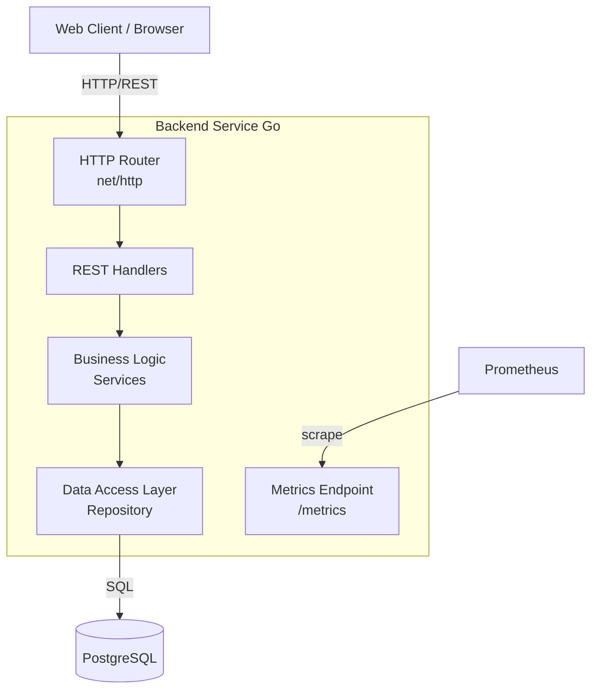
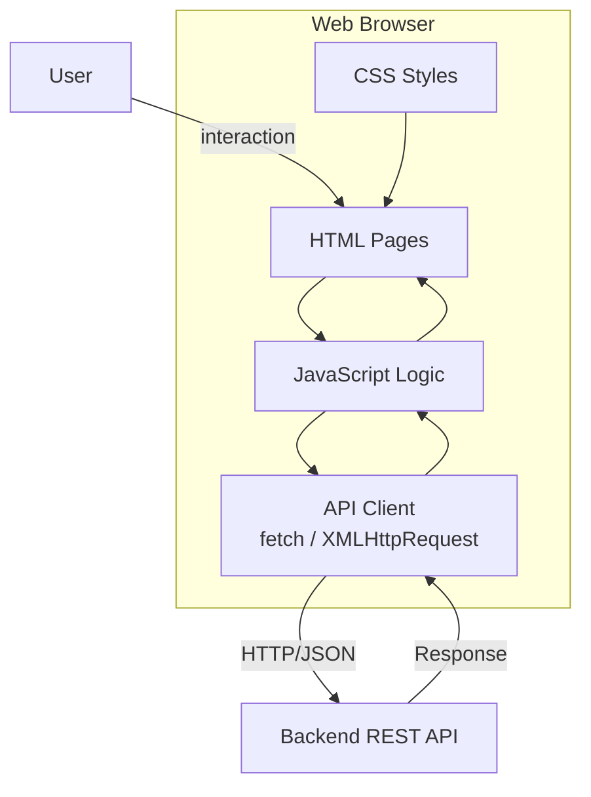
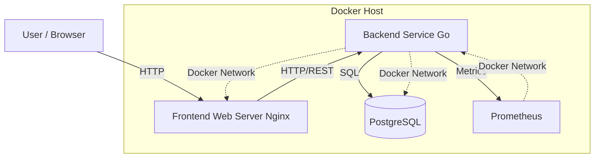
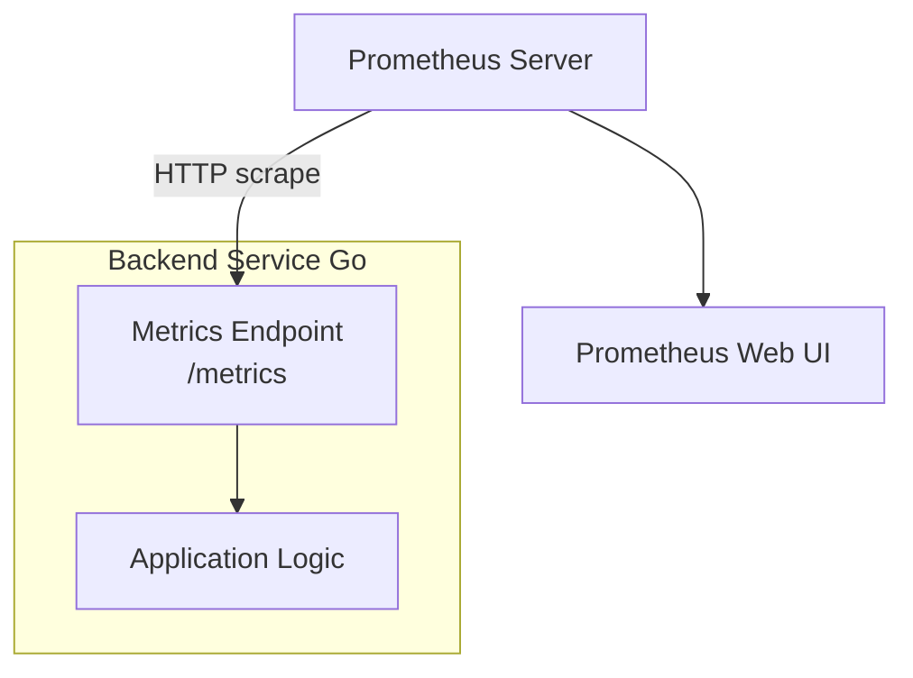
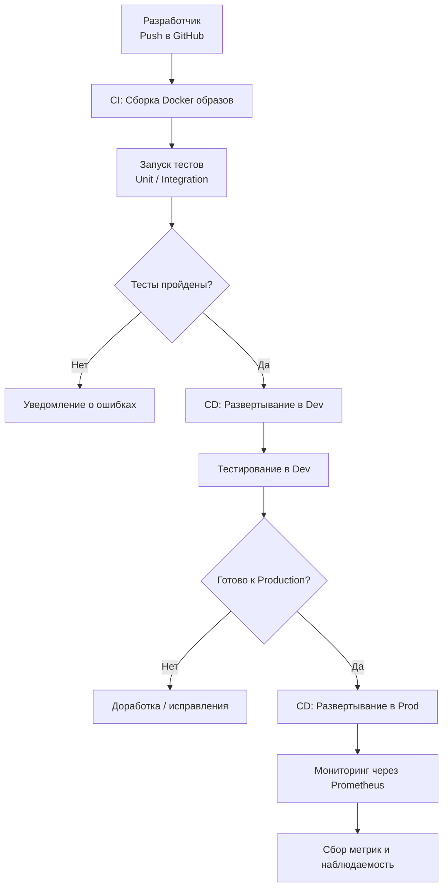
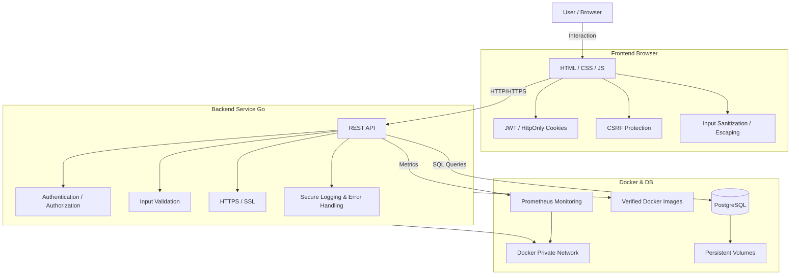

# ВКР: Разработка веб-приложения finalwork

## Введение

Современные веб-приложения играют ключевую роль в развитии информационных систем и цифровых сервисов. Рост числа пользователей, усложнение бизнес-логики, а также повышенные требования к производительности, отказоустойчивости и безопасности приводят к необходимости применения новых архитектурных и технологических подходов при разработке и эксплуатации веб-систем.

Традиционные веб-приложения, реализованные на основе устаревших технологических стеков и монолитной архитектуры, зачастую испытывают сложности при масштабировании, сопровождении и развертывании в различных средах. В связи с этим особую актуальность приобретает переход к современным решениям, включающим контейнеризацию, разделение сред разработки и эксплуатации, автоматизацию деплоя и использование систем мониторинга.

Язык программирования **Go** в настоящее время широко применяется для разработки серверных приложений благодаря высокой производительности, эффективной работе с параллельными вычислениями и наличию развитой стандартной библиотеки. Использование контейнеризации на базе **Docker** позволяет обеспечить воспроизводимость окружений, упростить развертывание и повысить надежность эксплуатации приложений. Дополнительно внедрение систем мониторинга, таких как **Prometheus**, предоставляет возможность контроля состояния системы и своевременного выявления проблем в продуктивной среде.

### Актуальность работы

Актуальность данной выпускной квалификационной работы обусловлена необходимостью перехода от устаревших подходов к разработке веб-приложений к современным архитектурным решениям, ориентированным на масштабируемость, безопасность и удобство сопровождения. Применение контейнеризации, систем мониторинга и современных языков программирования позволяет повысить качество программных продуктов и сократить затраты на их эксплуатацию.

### Цель и задачи выпускной квалификационной работы

**Целью выпускной квалификационной работы** является разработка многокомпонентного веб-приложения с использованием современных подходов к backend- и frontend-разработке, контейнеризации, развертыванию и мониторингу.

**Задачи проекта:**

1. Разработать серверную часть приложения на языке Go с реализацией REST API.  
2. Создать веб-интерфейс пользователя для взаимодействия с системой.  
3. Реализовать контейнеризацию компонентов приложения с использованием Docker и Docker Compose.  
4. Настроить систему мониторинга состояния и производительности приложения на базе Prometheus.  
5. Обеспечить базовые меры безопасности и подготовку приложения к эксплуатации в продуктивной среде.  
6. Подготовить документацию по развертыванию и эксплуатации разработанного веб-приложения.

### Объект и предмет исследования

**Объект исследования** — веб-приложения и инфраструктура их развертывания и эксплуатации.  
**Предмет исследования** — методы и средства разработки серверной части веб-приложений, контейнеризации сервисов, а также мониторинга и обеспечения готовности системы к работе в продуктивной среде.

### Практическая значимость работы

Практическая значимость работы заключается в разработке функционирующего веб-приложения и инфраструктуры его развертывания, которые могут быть использованы в реальных проектах, учебных и демонстрационных целях при изучении современных технологий веб-разработки.

---

## Описание проекта

Проект **finalwork** представляет собой веб-приложение с серверной частью на языке **Go**, веб-интерфейсом пользователя и инфраструктурой контейнеризации на основе **Docker**.  

Цель проекта — разработка современного многокомпонентного веб-приложения с возможностью масштабирования, обеспечения безопасности и мониторинга.

**Основные компоненты проекта:**

- **Backend (Go)** — серверная часть с REST API.  
- **Frontend (HTML/CSS/JS)** — веб-интерфейс пользователя.  
- **Database (PostgreSQL)** — реляционная база данных.  
- **Monitoring (Prometheus)** — система мониторинга метрик приложения.  
- **Containerization (Docker/Docker Compose)** — инфраструктура для развертывания.

---

## Архитектура проекта

### Backend

### Frontend

### Контейнеризация и развертывание

### Мониторинг

---

## CI/CD

---

## Безопасность

---

## Заключение

Выпускная квалификационная работа была посвящена разработке многокомпонентного веб-приложения **finalwork** с использованием современных подходов к веб-разработке, контейнеризации, развертыванию и мониторингу. В рамках работы были достигнуты поставленные цели и выполнены все задачи проекта.  

Основные результаты работы:

1. Разработан backend на Go с REST API.  
2. Создан frontend для взаимодействия пользователя с системой.  
3. Проведена контейнеризация всех компонентов через Docker/Docker Compose.  
4. Настроен мониторинг через Prometheus.  
5. Реализованы меры безопасности на всех уровнях приложения.  
6. Организован CI/CD процесс для автоматической сборки, тестирования и деплоя.

Разработанный проект соответствует современным требованиям к веб-приложениям и демонстрирует практическое применение актуальных технологий и DevOps-подходов. Архитектура приложения масштабируема и готова к дальнейшему расширению.  

Практическая значимость заключается в возможности использования приложения в реальных проектах, учебных и демонстрационных целях.  

В будущем проект может быть расширен с добавлением новых модулей, интеграцией систем оповещений и алертинга, расширением мониторинга и усилением мер безопасности.

